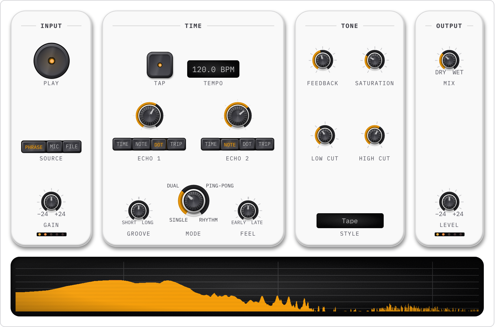

<p align="center">
  <picture>
    <source media="(prefers-color-scheme: dark)" srcset=".github/assets/wordmark-dark.png">
    
  </picture>
</p>

<p align="center">Native custom elements for audio interfaces: dials, sliders, meters and waveforms.<br>No framework, no runtime dependencies.</p>

<p align="center">
  <a href="https://xsynaptic.github.io/sonic-ui/">Live demo</a> ·
  <a href="https://xsynaptic.github.io/sonic-ui/club-mixer/">Club mixer</a> ·
  <a href="https://xsynaptic.github.io/sonic-ui/tape-echo/">Tape echo</a> ·
  <a href="https://xsynaptic.github.io/sonic-ui/web-player/">Web player</a> ·
  <a href="https://www.npmjs.com/package/@xsynaptic/sonic-ui">npm</a>
</p>

<p align="center">
  <a href="https://www.npmjs.com/package/@xsynaptic/sonic-ui"></a>
  <a href="LICENSE"></a>
</p>

<p align="center">
  <a href="https://xsynaptic.github.io/sonic-ui/tape-echo/">
    <picture>
      <source media="(prefers-color-scheme: dark)" srcset=".github/assets/hero-dark.png">
      
    </picture>
  </a>
</p>

## Usage

```sh
pnpm add @xsynaptic/sonic-ui
```

```js
import '@xsynaptic/sonic-ui/define';
```

```css
@import '@xsynaptic/sonic-ui/controls.css';
@import '@xsynaptic/sonic-ui/skins/amber.css';
```

```html
<body class="sonic-skin-amber">
	<sonic-dial aria-label="Cutoff" value="40"></sonic-dial>
</body>
```

The API may change before 1.0. Setup, and the rules every control follows, are in the [package README](packages/sonic-ui/README.md).

## Controls

| Kind           | Controls                                          |
| -------------- | ------------------------------------------------- |
| Value controls | dial, slider, number box, XY pad, envelope, split |
| Press controls | button, switch, toggle, segmented                 |
| Waves          | waveform, wavestrip                               |
| Displays       | meter, spectrum, LED, ring, screen, panel         |

## How it is built

- Controls render in the light DOM. Their parts, styles and ARIA are ordinary elements, so they can be inspected, styled and tested like the rest of the page.
- A skin is a single rule that sets `--sonic-*` custom properties. The bundled skins contain no selectors for a control's parts.
- Shading comes from one light: every directional gradient and shadow reads the same tilt token.
- Every control that takes input works from the keyboard, a value can be typed into a value control's readout, and forced-colours mode is supported.
- A control can be registered on its own from `./define/<control>`.
- Unit tests cover the arithmetic, and end-to-end tests cover what needs a real browser engine.

## Development

The library is in [`packages/sonic-ui`](packages/sonic-ui). The demo site is an Astro playground in [`playground`](playground). To run the playground, which rebuilds the library as you edit it:

```sh
pnpm install
pnpm dev
```

## Licence

Released under the [MIT licence](LICENSE).
